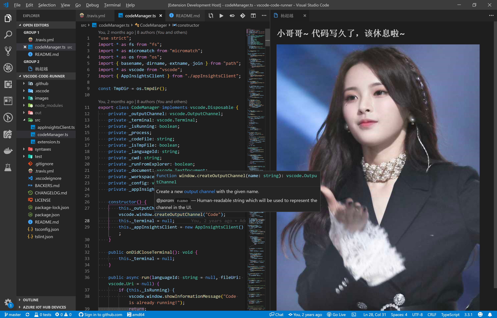

# 超越鼓励师

在 VS Code 中连续写代码一小时（时间可配置），会有杨超越提醒你该休息啦~

## 超越杯编程大赛

本插件正在参加第一届超越杯编程大赛，如果你喜欢，请为“超越鼓励师 for VS Code”投上一票吧！请使用微信或 QQ 扫描下面的二维码进行投票，并能查看作品的视频介绍。


## 使用

除了每过一小时会自动弹出提醒页面，也可以按 `F1`, 然后输入 `ycy: 打开提醒页面`来打开提醒页面



## 配置

* `ycy.reminderViewIntervalInMinutes`: 展示提醒页面的时间间隔（分钟）。(默认值为**60**)
* `ycy.title`: 提示文字。 (默认值为**小哥哥，小哥哥，代码写久了，该休息啦~**)

* `ycy.type`: 类型：defalut:默认图；url：图片地址。(默认值为**defalut**)
* `ycy.customImages`: 配置图片数组（需要搭配ycy.type为url） (默认值为**默认图片**)

```
如下例子：
"ycy.type": "url",
"ycy.customImages": [
    "https://timgsa.baidu.com/timg?image&quality=80&size=b9999_10000&sec=1555524615240&di=3d483d9a8ae67881458a6617f5f237a1&imgtype=0&src=http%3A%2F%2Fc1.haibao.cn%2Fimg%2F640_479_100_1%2F1534242453.4034%2F4b854e4dd2ca2124d953c913c02d73e6.jpg",
]
```
## 如何使用本地图片作为展示图片

* vscode不允许读取外部文件路径，所以只能自己去替换插件内的图片。替换步骤如下：
  
  1、找到vscode插件安装的地方 (如mac 在~/.vscode/extensions/formulahendry.ycy-{version})
  
  2、替换images/ycy内图片
  